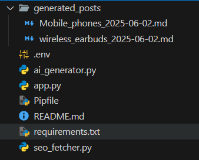
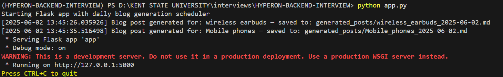
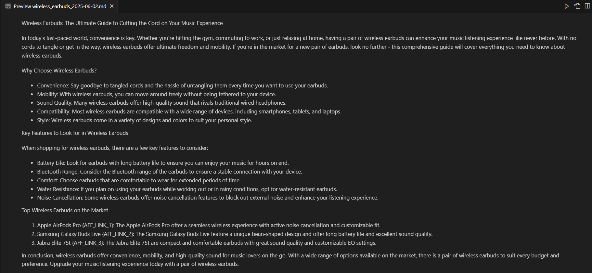

# 🧠 AI-Powered Blog Post Generator

A backend‑focused project that automates the generation of SEO‑optimized blog posts using OpenAI’s GPT models.  
Built with **Flask**, **APScheduler**, and the **OpenAI API**, this system can create posts on demand via an endpoint or automatically every day at midnight.

---

## 🚀 Features

- 🔗 **REST API** (`/generate`) to create blog posts by keyword  
- 🤖 **GPT‑generated Markdown** content with affiliate placeholders  
- 📊 **Mock SEO metrics** (search volume, difficulty, CPC)  
- 🕛 **Daily automation** via APScheduler (runs at 00:00)  
- 📝 Generated posts saved as `.md` files in `generated_posts/`

---

## 🏗️ Project Structure
```
ai-blog-generator-interview/
├── app.py # Flask app + scheduler + static serving
├── ai_generator.py # OpenAI prompt + placeholder replacement
├── seo_fetcher.py # Mock SEO metric provider
├── requirements.txt
├── .env # YOUR OpenAI key (git‑ignored)
├── generated_posts/ # Auto‑saved markdown posts
└── static/
  ├── index.html # Material UI + Marked.js
  └── styles.css # Custom overrides
```

---
### 🖥️ Using the UI

https://github.com/user-attachments/assets/8b3ce437-bb9e-45cc-bdf7-ca726334c84e


## 🔧 Setup Instructions
### 1  Get an OpenAI API key (if you don’t have one)

1. Sign in at https://platform.openai.com/ (create a free account if needed).

2. Click API keys → Create new secret key.

3. Copy the key (it starts with sk-…).

4. Paste it into your .env as shown above.

5. Confirm you have quota via Usage tab.

### 2 – Clone & enter the project

```bash
git clone https://github.com/your-username/ai-blog-generator-interview.git
cd ai-blog-generator-interview
```
### 3 – Create & activate a virtual environment
```
python -m venv venv
```
#### macOS/Linux:
```
source venv/bin/activate
```
#### Windows
```
venv\Scripts\activate
```
### 4 – Install dependencies
```
pip install -r requirements.txt
```
### 5 – Add your OpenAI key
Create .env

```
OPENAI_API_KEY= YOUR_API_KEY
```
### 🧪 Manual Usage (POSTMAN)
Endpoint
```
GET /generate?keyword=<your+keyword>

```
Example
```
http://localhost:5000/generate?keyword=wireless+earbuds

```
Sample JSON Response
```
{
  "keyword": "wireless earbuds",
  "seo_data": {
    "search_volume": 200,
    "keyword_difficulty": 42,
    "avg_cpc": 1.25
  },
  "saved_as": "generated_posts/wireless_earbuds_20250601_133501.md",
  "blog_post": "..."
}
```
### Screenshot
Postman Response


### 📂 Sample Output
Markdown files land in generated_posts/. Preview:




### 🕛 Daily Automation

- APScheduler calls scheduled_job() at 00:00 every day.

- Generates a post for each keyword in KEYWORDS.

- Saves it as generated_posts/<keyword>_<date>.md.


### 🧠 Why gpt-3.5-turbo?
1. Universal access & lower cost – ideal for daily, automated workloads.

2. Low latency – faster responses keep the scheduler lightweight.

3. Content quality is ample for structured blog articles; GPT‑4 can be swapped in if premium quality is required.

### 📸 Additional Screenshots
Run the app




Postman URL (GET):


Generated Blog Post:


### ➡️ Future Enhancements
1. Integrate real SEO APIs (Semrush, Ahrefs)

2. Add HTML export and automatic CMS publishing

3. Containerize with Docker & deploy via CI/CD

4. Switch to GPT‑4 or GPT‑4o when budget allows

### 👤 Author
Paritosh Gandre | MS Data Science

[LinkedIn](https://www.linkedin.com/in/paritosh-gandre-164b4a180/) 

[Email](paritoshkrcg@gmail.com)
